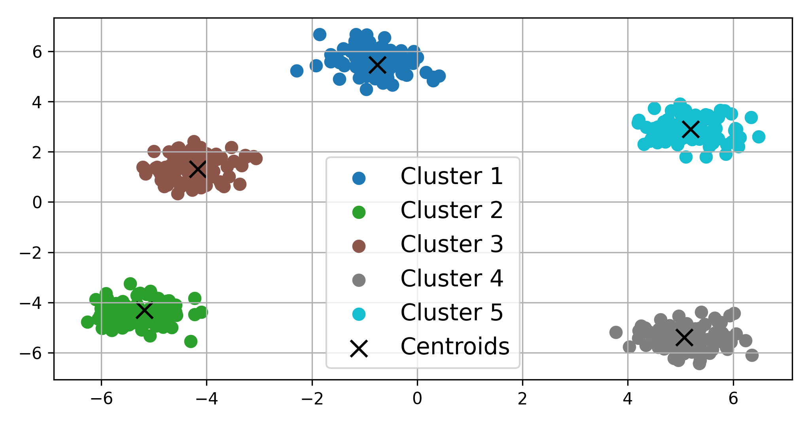
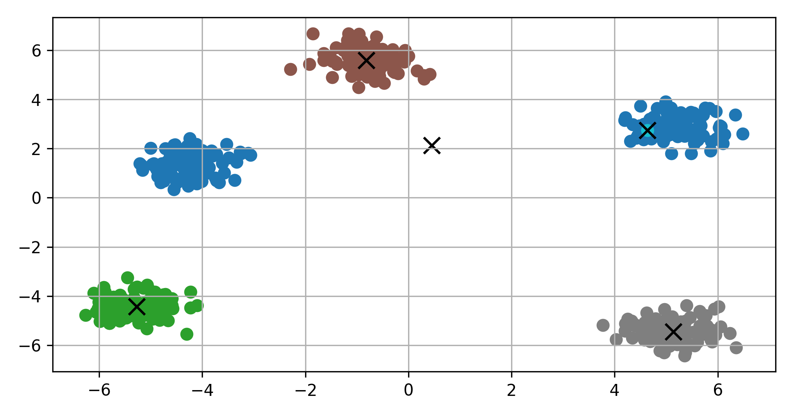
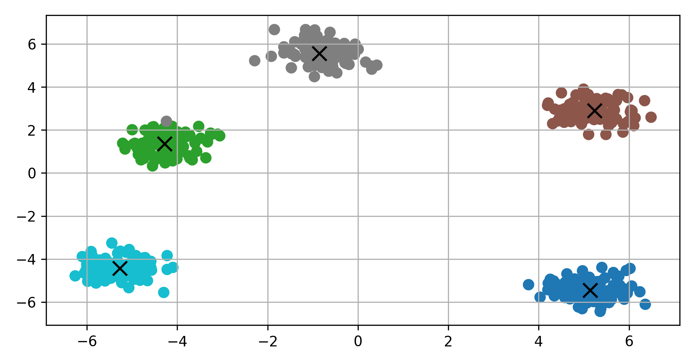
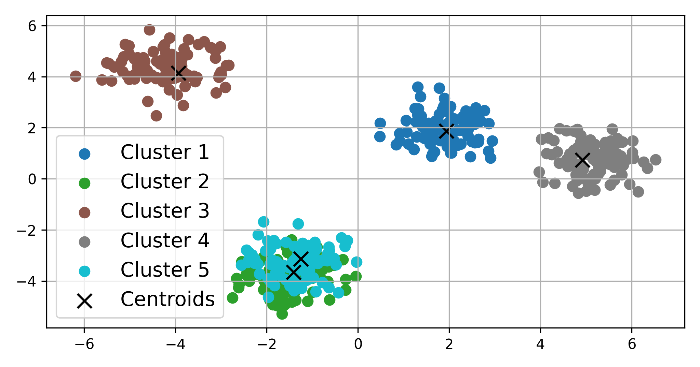
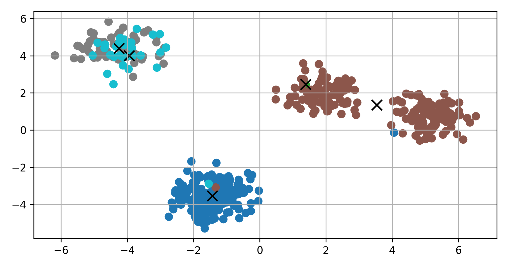
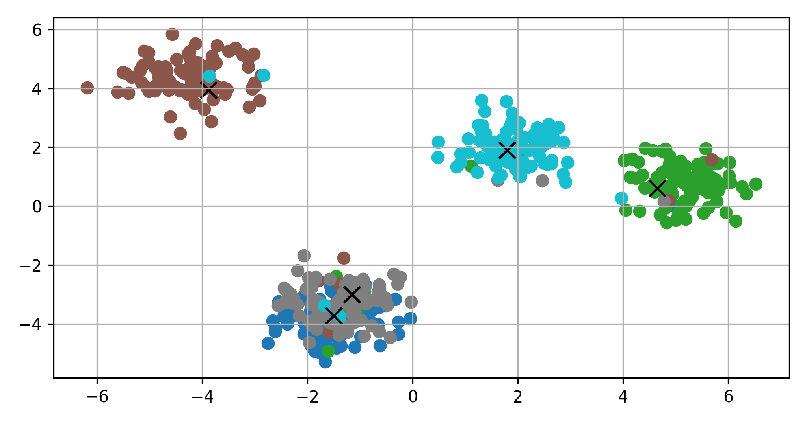
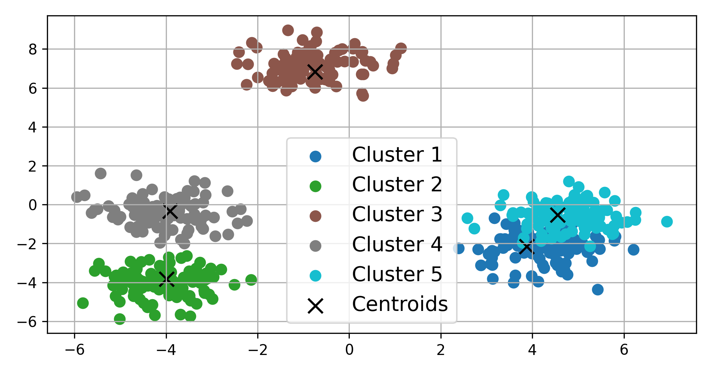
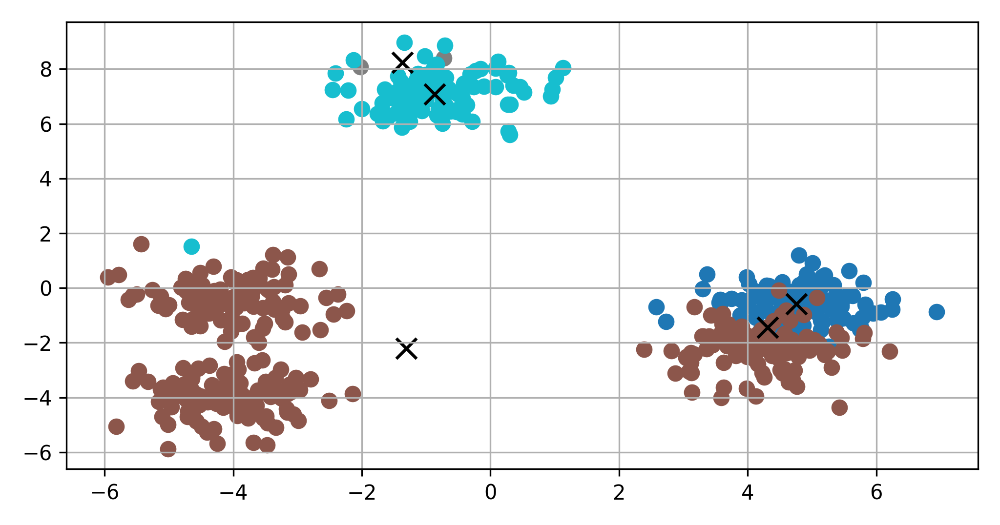
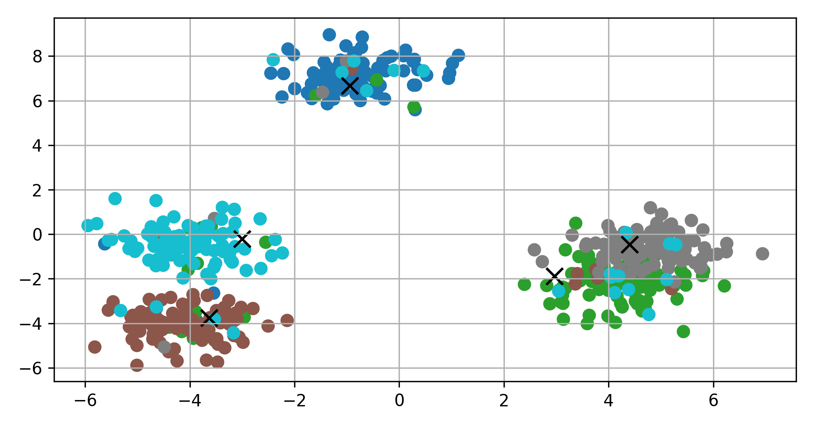

# CORING - Comparative Efficacy Study

This folder contains the code and datasets used in the comparative efficacy study of the CORING framework. In this study, we assess the performance of tensor-based and matrix-based methodologies using the K-means clustering algorithm with custom distance metrics.

## Experimental Setup

### Datasets

We generated a set of synthetic datasets characterized by:
- Total datasets (D): 1000
- Clusters per dataset (c): 5
- Centroid tensor dimensions (C_in x h x w): 64 x 3 x 3
- Number of satellite tensors (n) per cluster: 100

### Dataset Complexity

Dataset complexity is governed by the standard deviations of centroids (σ_centroids) and satellite tensors (σ_satellites). We designed datasets with three difficulty levels:

1. Normal:
   - σ_centroids: [1.7, 1.8]
   - σ_satellites: [0.2, 0.3]

2. Moderate:
   - σ_centroids: [1.5, 2.0]
   - σ_satellites: [0.1, 0.3]

3. Hard:
   - σ_centroids: [1.0, 2.0]
   - σ_satellites: [0.1, 0.5]

## Evaluation

We evaluated the K-means algorithm's performance using the Adjusted Rand Index (ARI), a measure of similarity between ground truth and predictions. Higher ARI values (α in [-1, 1]) indicate superior predictive accuracy, with α = 0 implying predictions are no better than random chance concerning ground truth.

To account for K-means initialization sensitivity, we performed multiple initializations (i) and selected the one yielding the best inertia value, defined as the sum of distances between samples and their corresponding centroids, upon convergence, following sklearn guidelines.

## Experimental Results

The mean ARIs, as presented in Table 1, unequivocally establish the superior performance of the tensor-based approach. Both approaches exhibit proficiency on less intricate datasets; however, in scenarios where dataset complexity escalates, our tensor-based methodology consistently demonstrates heightened consistency and effectiveness. This enhanced performance can be attributed to our method's ability to preserve the multidimensionality of the filters, allowing it to capture and retain crucial information effectively.

Table 1: ARI of the tensor-based and matrix-based method

| Method | Normal | Moderate | Hard |
|--------|--------|----------|------|
| Matrix | 0.83   | 0.61     | 0.54 |
| Tensor | **0.91** | **0.82** | **0.73** |

We have included representative datasets based on the ARI of predictions that closely align with the mean ARI across the entire dataset (3 scenarios, each containing 1000 datasets). These representative datasets are employed to illustrate typical outcomes of both methods, as presented in Table 2.

### Table 2: Visualizing the performance of tensor-based and matrix-based methods

|   | Groundtruth | Matrix  | Tensor  |
|---|:-------------:|:------------------:|:------------------:|
| **Normal**   |  |  |  |
| **Moderate** |  |  |  |
| **Hard**     |  |  |  |

In Table 2, we provide visualizations of the performance of both tensor-based and matrix-based methods on representative datasets of different difficulty levels. These visualizations clearly demonstrate the superiority of the tensor-based method, as indicated by higher ARI values.


## Reproducing Results

To reproduce the experimental results, follow these steps:

1. Generate the datasets using `data.py`:
   ```bash
   python data.py --data your_datapath
   ```
   Please replace `your_datapath` with the appropriate path to your dataset, e.g, `normal-699.npy`.
2. Run experiments on the datasets:
   - For normal dataset:
   ```bash
   python kmeans.py --data normal-699.npy --seed 91 --method matrix
   python kmeans.py --data normal-699.npy --seed 1
   ```
   - For moderate dataset:
   ```bash
   python kmeans.py --data moderate-65.npy --seed 66 --method matrix
   python kmeans.py --data moderate-65.npy --seed 33
   ```
   - For hard dataset:
   ```bash
   python kmeans.py --data hard-404.npy --seed 66 --method matrix
   python kmeans.py --data hard-404.npy --seed 19
   ```
